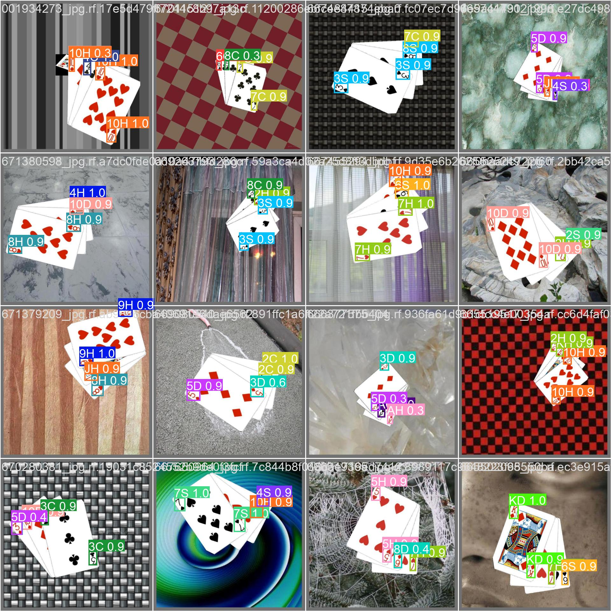
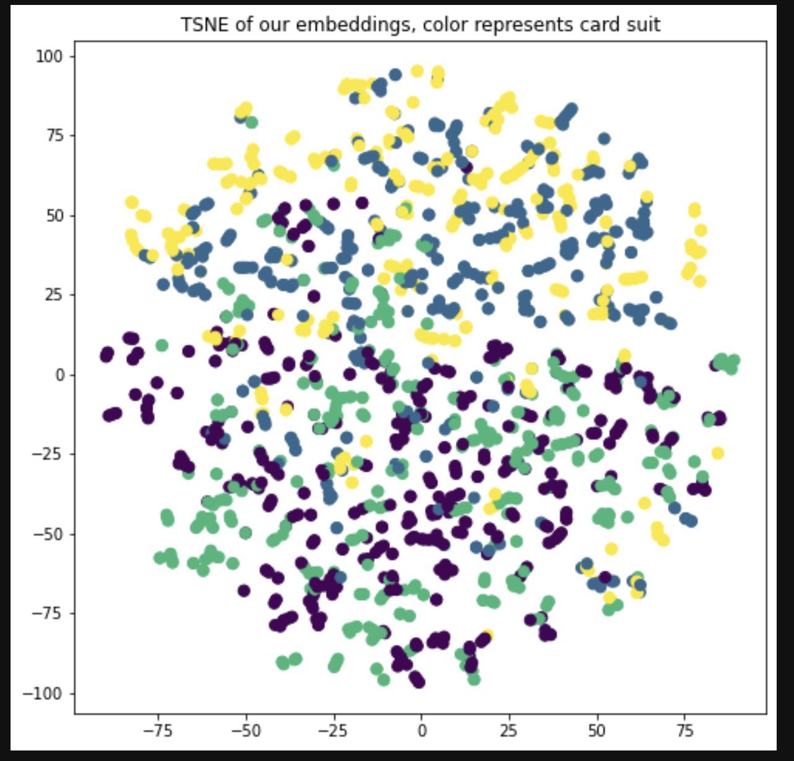

# Contrastive YoLo (cYLo) detection of cards

Most of the code is taken from official [Yolo-v5](https://github.com/ultralytics/yolov5) repository. Kudos to ultralytics.

## Examples:



## Goal
To install required dependences, run (note that numpy version should be <1.24.0):
```
pip install -r requirements.txt
pip install pyrallis
```

The idea is to implement self-supervised learning for cards, on which object detection model (like YoLo) was not trained. If threshold given by Yolo is small for card (thus most likely it was not in training dataset), then label is given by the most "similiar" card (e.g in the sense of L2 norm or closest cluster of labels).

## Getting labeled dataset
All data configs are located in `data` folder
In roboflow folder you can find script for downloading different datasets into `datasets` folder like this:

```
python roboflow/get_dataset.py --dataset_name "name of dataset" --api_key "your api key from roboflow" \\
                               --workspace_name "name of workspace" --project "name of project" \\
                               --model "yolov5"
```

## Running Yolo

Running script is the same with minor changes from official repo:

```
python train.py --img 640 --batch 16 --epochs 30 \\
                --data data/"name of config file".yaml --weights "pretrained model"
```

## !! Running metric learning !!
First, install Open-Metric-Learning library [OML](https://github.com/OML-Team/open-metric-learning)
```
pip install -U open-metric-learning
```
Then, you will need to get csv file containing `path` and `label` columns with annotated several examples (in our experiments we annotated only 10% of cards for contrastive learning as warmup).
For tutorial how to do this (complete walkthrough), look at `metric_learning/tutorials/OML.ipynb` file. In our experiments, we took `ViTExtractor` as for trainable embedding head. And for training loss we took TripletLoss.

To get embeddings of dataset, run `metric_learning/contrastive.py`

## Pretrained Weights

| Default cards (52)  | 
| ------------------- |
| [Cards](https://drive.google.com/file/d/1mdOGq-HdlIKMlzUMJzcpOw3FR3lDQTa_/view?usp=sharing)|